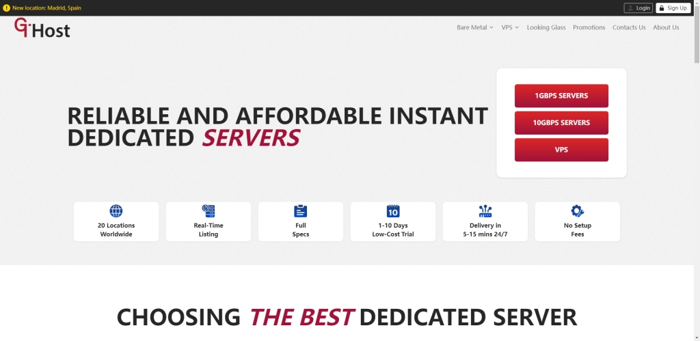

# GTHost美国独立服务器夏季促销：三个月111.72美元起，四大机房任选

最近需要部署美国物理服务器？预算有限但又想要性能？GTHost这次夏季促销可能值得看看——Ryzen 9 7950X3D、AMD EPYC等高配独服，季付起步价111.72美元，免安装费，15分钟内上架。无论你是要跑高性能计算、大流量网站，还是搭建游戏服务器，这次活动覆盖亚特兰大、纽约、洛杉矶、圣何塞四个机房，都能找到合适的选择。

---

## GTHost是谁？

GTHost，2012年成立的加拿大老牌服务器商家。这家公司的特点是机房多——美国、加拿大、欧洲一共二十多个数据中心，从VPS到独立服务器到GPU服务器都有。

支付方式也很友好：支付宝、PayPal、VISA、万事达都行。对国内用户来说，支付宝直接付款省去了很多麻烦。

官网地址：[https://gthost.com](https://cp.gthost.com/en/join/72c7e6b2fc118929f9ede2978f008806)

---

## 这次促销的具体内容

先说重点：

**促销时间**：截止到2025年7月30日  
**优惠码**：Jul-2025-20  
**折扣力度**：独立服务器8折  
**参与机房**：美国亚特兰大、纽约、洛杉矶、圣何塞  
**付款要求**：季付或更长周期（月付不参与）  
**服务器类型**：Ryzen 9 7950X3D、AMD EPYC、Xeon Gold、Xeon Silver系列

算笔账：假设某款独服原价139.65美元/季，用上优惠码后是111.72美元/季。15分钟内上架，免安装费。这个速度和价格，对比其他服务商的部署周期和额外费用，确实有优势。

---

## 四个机房怎么选？

每个机房的网络环境和适用场景不太一样：

**洛杉矶机房**  
离亚洲最近，国内访问延迟相对较低。如果你的主要用户在国内或亚太地区，洛杉矶是首选。适合建站、CDN源站、游戏服务器。

**圣何塞机房**  
硅谷所在地，网络质量稳定。同样对亚洲友好，但相比洛杉矶可能稍微远一点点。不过这里的带宽质量通常很不错，适合跑需要稳定连接的应用。

**纽约机房**  
东海岸核心节点，面向北美东部和欧洲用户更合适。如果你的业务主要在美东或者需要覆盖欧美两端，纽约机房延迟会更均衡。

**亚特兰大机房**  
美国东南部重要节点，网络覆盖范围广。价格可能比纽约稍微有优势，适合预算敏感但又需要东海岸位置的场景。

👉 [需要测试各机房的实际速度？点这里查看GTHost官方测试页面](https://cp.gthost.com/en/join/72c7e6b2fc118929f9ede2978f008806)

---

## 硬件配置说明

这次促销涵盖多种处理器系列：

**Ryzen 9 7950X3D系列**  
AMD最新的3D V-Cache处理器，单核性能和多核性能都很强。适合游戏服务器、视频转码、编译任务等需要强劲CPU的场景。

**AMD EPYC系列**  
企业级处理器，核心数多，适合虚拟化、容器部署、大规模并发处理。如果你要在一台服务器上跑多个虚拟机或容器，EPYC是好选择。

**Xeon Gold/Silver系列**  
Intel的经典企业级处理器，稳定性好，兼容性强。适合数据库服务器、企业应用、传统业务迁移。

---

## 带宽和网络

GTHost的独立服务器分两种带宽配置：

- **1Gbps带宽**：日常建站、中小型应用够用
- **10Gbps带宽**：高流量网站、CDN、视频流媒体必备

这次促销的机房都提供不限流量套餐（具体看选择的配置）。不用担心流量超标，也不用半夜盯着流量监控。

---

## 15分钟上架是什么体验？

传统服务器商家，从下单到上架，快的要几小时，慢的要一两天。GTHost承诺15分钟内上架——实测基本能做到。

下单付款后，系统自动分配硬件、安装系统、配置网络。大概十几分钟，你就能收到IP和登录信息，直接SSH连上去开始部署。

这个速度对紧急项目或者临时需求来说，是真的方便。不用等，不用催客服，不用改计划。

---

## 适合什么场景？

**大流量网站**  
10Gbps带宽 + 不限流量，扛住突发流量不是问题。论坛、电商、下载站都适合。

**游戏服务器**  
低延迟 + 高性能CPU，洛杉矶和圣何塞机房对国内玩家友好。开服快，网络稳定。

**虚拟化和容器**  
EPYC多核处理器，跑Docker、Kubernetes、Proxmox之类的虚拟化平台很流畅。一台服务器当多台用。

**开发测试环境**  
需要美国IP的CI/CD、爬虫、API测试？独立服务器比VPS稳定，资源独享，不会被邻居影响。

**视频转码和渲染**  
Ryzen 9 7950X3D的单核性能和多线程能力，处理视频编码、3D渲染效率高。

---

## 注意事项

**只有季付及以上周期参与促销**  
月付不能用优惠码。如果确定要长期使用，直接买季付或年付更划算。

**只有四个机房参与**  
GTHost有二十多个机房，但这次促销只限定亚特兰大、纽约、洛杉矶、圣何塞。其他机房原价。

**优惠码要手动输入**  
下单时别忘了填写优惠码"Jul-2025-20"。不填的话系统不会自动打折。

**配置多，价格差异大**  
从入门级配置到高配版本，价格跨度挺大。根据实际需求选择，不要盲目追求高配——够用就行。

---

## 总结

GTHost这次夏季促销，针对需要美国物理服务器的场景，提供了一个性价比不错的选择。8折力度 + 免安装费 + 15分钟快速上架，对比市场上其他服务商的部署周期和额外费用，确实有竞争力。

如果你正好有美国服务器需求，预算在几百美元范围内，又不想等太久，👉 [不妨试试GTHost的独立服务器](https://cp.gthost.com/en/join/72c7e6b2fc118929f9ede2978f008806)——四个机房任选，多种硬件配置，快速部署，支付宝直接付款。促销截止到7月30日，想入手的话别拖太久。
